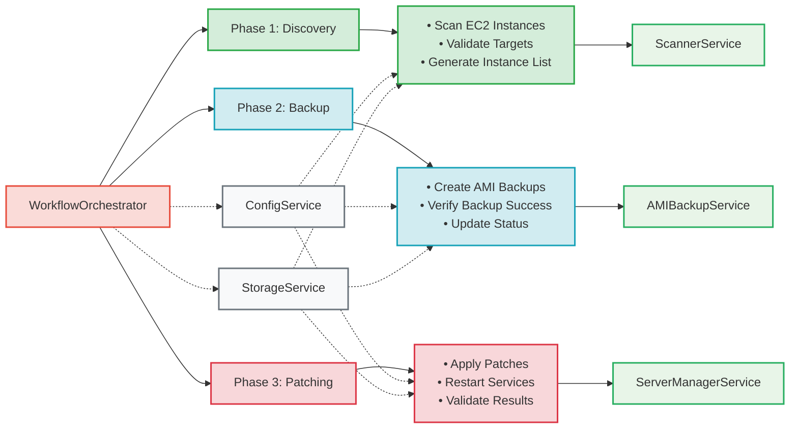
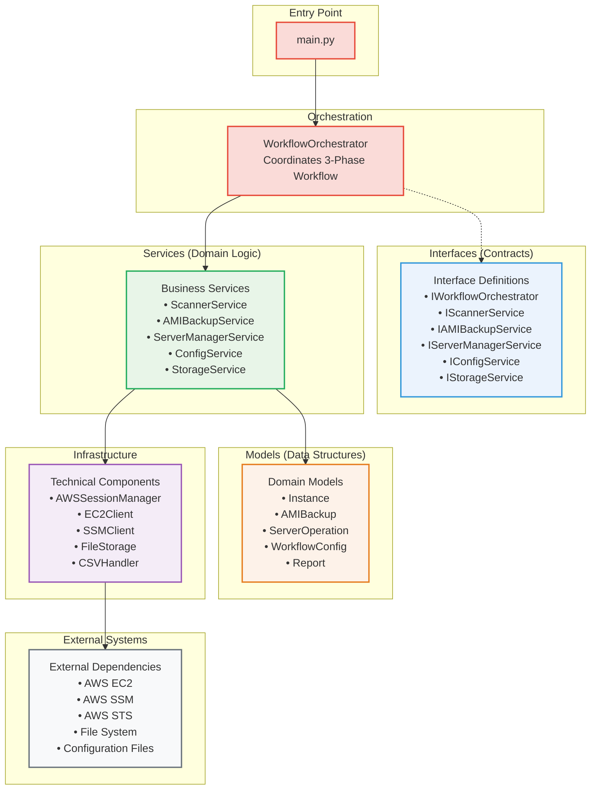

# CMS Patching Tool - Architecture Flow (Mermaid)

## Main Architecture Flow

```mermaid
flowchart TD
    %% Entry Point
    A[main.py] --> B[WorkflowOrchestrator]
    
    %% Interfaces Layer
    B -.-> I1[IWorkflowOrchestrator]
    B -.-> I2[IScannerService]
    B -.-> I3[IAMIBackupService]
    B -.-> I4[IServerManagerService]
    B -.-> I5[IConfigService]
    B -.-> I6[IStorageService]
    
    %% Orchestration to Services (3-Phase Workflow)
    B -->|Phase 1: Discovery| S1[ScannerService]
    B -->|Phase 2: Backup| S2[AMIBackupService]
    B -->|Phase 3: Patching| S3[ServerManagerService]
    B -.->|Support| S4[ConfigService]
    B -.->|Support| S5[StorageService]
    
    %% Services to Models
    S1 --> M1[Instance]
    S1 --> M2[WorkflowResult]
    S2 --> M3[AMIBackup]
    S3 --> M4[ServerOperation]
    S4 --> M5[WorkflowConfig]
    S5 --> M6[Report]
    S5 --> M7[LandingZone]
    
    %% Services to Infrastructure
    S1 --> INF1[AWSSessionManager]
    S1 --> INF2[EC2Client]
    S2 --> INF2
    S3 --> INF3[SSMClient]
    S4 --> INF4[FileStorage]
    S5 --> INF5[CSVHandler]
    
    %% Infrastructure to External Systems
    INF1 --> EXT1[AWS STS]
    INF2 --> EXT2[AWS EC2]
    INF3 --> EXT3[AWS SSM]
    INF4 --> EXT4[File System]
    INF5 --> EXT4
    S4 --> EXT5[Configuration Files]
    
    %% Styling
    classDef entryPoint fill:#fadbd8,stroke:#e74c3c,stroke-width:2px
    classDef interface fill:#ebf3fd,stroke:#3498db,stroke-width:2px
    classDef orchestration fill:#fadbd8,stroke:#e74c3c,stroke-width:2px
    classDef service fill:#e8f5e8,stroke:#27ae60,stroke-width:2px
    classDef model fill:#fdf2e9,stroke:#e67e22,stroke-width:2px
    classDef infrastructure fill:#f4ecf7,stroke:#9b59b6,stroke-width:2px
    classDef external fill:#f8f9fa,stroke:#6c757d,stroke-width:2px
    
    class A entryPoint
    class I1,I2,I3,I4,I5,I6 interface
    class B orchestration
    class S1,S2,S3,S4,S5 service
    class M1,M2,M3,M4,M5,M6,M7 model
    class INF1,INF2,INF3,INF4,INF5 infrastructure
    class EXT1,EXT2,EXT3,EXT4,EXT5 external
```

## 3-Phase Workflow Detail

## Layer Dependencies

## Usage Instructions

### Viewing Mermaid Diagrams

1. **GitHub/GitLab**: These diagrams will render automatically in README files
2. **VS Code**: Install the "Mermaid Preview" extension
3. **Online**: Copy the code to [mermaid.live](https://mermaid.live)
4. **Documentation**: Most modern documentation platforms support Mermaid

### Key Benefits of This Format

- **Version Control Friendly**: Plain text format tracks changes easily
- **Editable**: Can be modified with any text editor
- **Portable**: Works across different platforms and tools
- **Interactive**: Some renderers allow zooming and interaction
- **Maintainable**: Easy to update as architecture evolves

### Color Legend

- **Red**: Entry Point & Orchestration
- **Blue**: Interfaces (Contracts)
- **Green**: Services (Domain Logic)
- **Orange**: Models (Data Structures)
- **Purple**: Infrastructure
- **Gray**: External Systems
- **Phase Colors**: Green (Discovery), Blue (Backup), Red (Patching)