# CMS Patching Tool - Complete Flow Diagram

This document provides a comprehensive flow diagram of the CMS Patching Tool workflow, showing all phases, decision points, and error handling paths.

## Overview

The patching workflow follows a clean architecture pattern with clear separation of concerns:

### Core Workflow Phases

1. **Scanner Phase**: Discover and inventory EC2 instances across landing zones
2. **AMI Backup Phase**: Create AMI backups for discovered instances
3. **Server Manager Phase**: Manage instance states and prepare for patching
4. **Precheck Phase**: Validate instance readiness for patching (optional)
5. **Patch Phase**: Execute patching operations (optional)
6. **Full Workflow**: Execute all phases sequentially

### Architecture Layers

- **Entry Point**: `main.py` - Application bootstrap and CLI handling
- **Orchestration**: `WorkflowOrchestrator` - Coordinates 3-phase workflow
- **Services**: Domain services for each phase (Scanner, AMIBackup, ServerManager)
- **Infrastructure**: AWS clients, storage, and session management
- **Models**: Data structures for instances, configurations, and results

## Complete Flow Diagram

```mermaid
flowchart TD
    %% Entry Point and Initialization
    A[main.py] --> B{Configuration Source?}
    B -->|CLI Args| C[Parse CLI Arguments]
    B -->|Config File| D[Load YAML Configuration]
    C --> E[ConfigService: Validate Configuration]
    D --> E
    E --> F[Initialize Core Services]
    F --> G{Workflow Type?}

    %% Service Initialization
    F --> F1[AWSSessionManager: Initialize]
    F1 --> F2[Assume Roles for Landing Zones]
    F2 --> F3[Initialize AWS Clients: EC2, SSM, STS]
    F3 --> F4[StorageService: Initialize]
    F4 --> F5[ReportService: Initialize]
    F5 --> G

    %% Workflow Branching
    G -->|scanner| O[SCANNER PHASE]
    G -->|backup| P[BACKUP PHASE - Requires Scan Results]
    G -->|server-manager| SM[SERVER MANAGER PHASE]
    G -->|precheck| Q[PRECHECK PHASE]
    G -->|patch| R[PATCH PHASE]
    G -->|full| S[FULL WORKFLOW - 3 Phase]
    G -->|Invalid| H[Error: Invalid Workflow Type]

    %% SCANNER PHASE (Phase 1)
    O --> O1[ScannerService: Initialize]
    O1 --> O2[WorkflowOrchestrator: Start Scanner Phase]
    O2 --> O3[For Each Landing Zone]
    O3 --> O4[EC2Client: Describe Instances]
    O4 --> O5[Apply Tag Filters and Criteria]
    O5 --> O6[SSMClient: Get Instance Information]
    O6 --> O7[Collect Instance Metadata]
    O7 --> O8[ValidationService: Validate Instance]
    O8 --> O9{More Landing Zones?}
    O9 -->|Yes| O3
    O9 -->|No| O10[Aggregate Discovery Results]
    O10 --> O11[ReportService: Generate Multi-format Reports]
    O11 --> O12[StorageService: Save CSV Results]
    O12 --> END1[End: Scanner Complete]

    %% AMI BACKUP PHASE (Phase 2)
    P --> P1[AMIBackupService: Initialize]
    P1 --> P2[Load Scanner Results from CSV]
    P2 --> P3{Instances Found for Backup?}
    P3 -->|No| P4[Exit: No Instances to Backup]
    P3 -->|Yes| P5[WorkflowOrchestrator: Start Backup Phase]
    P5 --> P6[For Each Instance Running and Stopped]
    P6 --> P7[EC2Client: Create AMI Backup]
    P7 --> P8[Apply Backup Tags with Metadata]
    P8 --> P9[Monitor AMI Creation Progress]
    P9 --> P10{AMI Creation Complete?}
    P10 -->|No| P11[Check Timeout Status]
    P11 --> P12{Timeout Reached?}
    P12 -->|Yes| P13[Mark as Failed - Timeout]
    P12 -->|No| P9
    P10 -->|Yes| P14[Verify AMI Success]
    P14 --> P15[Mark as Success]
    P13 --> P16{More Instances?}
    P15 --> P16
    P16 -->|Yes| P6
    P16 -->|No| P17[Update CSV with Backup Status]
    P17 --> P18[Generate Backup Report]
    P18 --> P19[StorageService: Save Results]
    P19 --> END2[End: AMI Backup Complete]

    %% SERVER MANAGER PHASE (Phase 3)
    SM --> SM1[ServerManagerService: Initialize]
    SM1 --> SM2[Load Previous Phase Results]
    SM2 --> SM3{Instances Found?}
    SM3 -->|No| SM4[Exit: No Instances to Manage]
    SM3 -->|Yes| SM5[WorkflowOrchestrator: Start Server Manager Phase]
    SM5 --> SM6[For Each Instance]
    SM6 --> SM7[Check Current Instance State]
    SM7 --> SM8{Instance State?}
    SM8 -->|Stopped| SM9[EC2Client: Start Instance]
    SM8 -->|Running| SM10[Verify Instance Health]
    SM8 -->|Other| SM11[Log State - No Action]
    SM9 --> SM12[Wait for Instance Running]
    SM12 --> SM13{Instance Started?}
    SM13 -->|No| SM14[Mark as Failed to Start]
    SM13 -->|Yes| SM15[Verify SSM Connectivity]
    SM10 --> SM15
    SM15 --> SM16[Update Instance Status]
    SM11 --> SM16
    SM14 --> SM16
    SM16 --> SM17{More Instances?}
    SM17 -->|Yes| SM6
    SM17 -->|No| SM18[Update CSV with Current States]
    SM18 --> SM19[Generate Server Manager Report]
    SM19 --> SM20[StorageService: Save Results]
    SM20 --> END_SM[End: Server Manager Complete]

    %% PRECHECK PHASE
    Q --> Q1[ServerManagerService: Initialize]
    Q1 --> Q2[Load Previous Results]
    Q2 --> Q3[For Each Instance]
    Q3 --> Q4[SSMClient: Check Connectivity]
    Q4 --> Q5{SSM Connected?}
    Q5 -->|No| Q6[Mark as Unreachable]
    Q5 -->|Yes| Q7[Run Pre-patch Checks]
    Q7 --> Q8[Check Disk Space]
    Q8 --> Q9[Check System Load]
    Q9 --> Q10[Check Critical Services]
    Q10 --> Q11[ValidationService: Validate Readiness]
    Q11 --> Q12{Ready for Patching?}
    Q12 -->|No| Q13[Mark as Not Ready]
    Q12 -->|Yes| Q14[Mark as Ready]
    Q6 --> Q15{More Instances?}
    Q13 --> Q15
    Q14 --> Q15
    Q15 -->|Yes| Q3
    Q15 -->|No| Q16[Generate Precheck Report]
    Q16 --> Q17[StorageService: Save Results]
    Q17 --> END3[End: Precheck Complete]

    %% PATCH PHASE
    R --> R1[ServerManagerService: Initialize]
    R1 --> R2[Load Precheck Results]
    R2 --> R3{Ready Instances Found?}
    R3 -->|No| R4[Exit: No Instances Ready]
    R3 -->|Yes| R5[For Each Ready Instance]
    R5 --> R6[SSMClient: Start Patch Session]
    R6 --> R7[Execute Patch Commands]
    R7 --> R8[Monitor Patch Progress]
    R8 --> R9{Patch Complete?}
    R9 -->|No| R10[Check Timeout]
    R10 --> R11{Timeout Reached?}
    R11 -->|Yes| R12[Mark as Failed]
    R11 -->|No| R8
    R9 -->|Yes| R13[Verify Patch Success]
    R13 --> R14{Verification Passed?}
    R14 -->|No| R15[Mark as Partial Success]
    R14 -->|Yes| R16[Mark as Success]
    R12 --> R17{More Instances?}
    R15 --> R17
    R16 --> R17
    R17 -->|Yes| R5
    R17 -->|No| R18[Generate Patch Report]
    R18 --> R19[StorageService: Save Results]
    R19 --> END4[End: Patch Complete]

    %% FULL WORKFLOW (3-Phase Architecture)
    S --> S1[WorkflowOrchestrator: Initialize 3-Phase Workflow]
    S1 --> S2[Phase 1: Execute SCANNER PHASE]
    S2 --> S3{Scanner Phase Successful?}
    S3 -->|No| S4[Log Scanner Errors]
    S4 --> S5[Generate Partial Report]
    S5 --> ERR_EXIT[Exit with Scanner Error]
    S3 -->|Yes| S6[Phase 2: Execute AMI BACKUP PHASE]
    S6 --> S7{Backup Phase Successful?}
    S7 -->|No| S8[Log Backup Errors]
    S8 --> S9[Generate Partial Report with Scanner Data]
    S9 --> ERR_EXIT2[Exit with Backup Error]
    S7 -->|Yes| S10[Phase 3: Execute SERVER MANAGER PHASE]
    S10 --> S11{Server Manager Phase Successful?}
    S11 -->|No| S12[Log Server Manager Errors]
    S12 --> S13[Generate Report with Available Data]
    S13 --> ERR_EXIT3[Exit with Server Manager Error]
    S11 -->|Yes| S14[All Phases Complete Successfully]
    S14 --> S15[Aggregate All Phase Results]
    S15 --> S16[ReportService: Create Comprehensive Reports]
    S16 --> S17[Generate CSV Report with All Data]
    S17 --> S18[Generate JSON Report with Metadata]
    S18 --> S19[Generate HTML Dashboard]
    S19 --> S20[Generate XML Report for Integration]
    S20 --> S21[Generate Final Summary Report]
    S21 --> END5[End: Full 3-Phase Workflow Complete]

    %% Error Handling and Recovery
    H --> ERROR[Centralized Error Handling]
    P4 --> ERROR
    SM4 --> ERROR
    Q4 --> ERROR
    R4 --> ERROR
    ERR_EXIT --> ERROR
    ERR_EXIT2 --> ERROR
    ERR_EXIT3 --> ERROR

    ERROR --> ERR1[Log Detailed Error Information]
    ERR1 --> ERR2[Capture Error Context and Stack Trace]
    ERR2 --> ERR3[Generate Error Report with Diagnostics]
    ERR3 --> ERR4[Cleanup AWS Resources and Sessions]
    ERR4 --> ERR5[Save Partial Results if Available]
    ERR5 --> ERR6[Exit with Appropriate Error Code]

    %% Async Operations and Monitoring
    O6 --> ASYNC1[Async: Concurrent Landing Zone Processing]
    P9 --> ASYNC2[Async: Concurrent AMI Creation Monitoring]
    SM12 --> ASYNC3[Async: Concurrent Instance State Management]

    %% Styling
    classDef phaseBox fill:#e1f5fe,stroke:#01579b,stroke-width:2px
    classDef serviceBox fill:#f3e5f5,stroke:#4a148c,stroke-width:2px
    classDef orchestratorBox fill:#e8f5e8,stroke:#2e7d32,stroke-width:2px
    classDef decisionBox fill:#fff3e0,stroke:#e65100,stroke-width:2px
    classDef errorBox fill:#ffebee,stroke:#b71c1c,stroke-width:2px
    classDef endBox fill:#c8e6c9,stroke:#1b5e20,stroke-width:2px
    classDef asyncBox fill:#f1f8e9,stroke:#33691e,stroke-width:2px

    %% Phase Classifications
    class O,P,SM,Q,R,S phaseBox
    class O1,O2,P1,P5,SM1,SM5,Q1,R1,S1 orchestratorBox
    class O1,P1,SM1,Q1,R1,S16 serviceBox
    class B,G,P3,SM3,SM8,SM13,Q5,Q12,R3,R9,R14,S3,S7,S11 decisionBox
    class H,ERROR,ERR1,ERR2,ERR3,ERR4,ERR5,ERR6,ERR_EXIT,ERR_EXIT2,ERR_EXIT3 errorBox
    class END1,END2,END_SM,END3,END4,END5 endBox
    class ASYNC1,ASYNC2,ASYNC3 asyncBox
```



## Phase Details

### Core 3-Phase Architecture

The CMS Patching Tool implements a streamlined 3-phase workflow designed for pre-patch preparation:

### Phase 1: Scanner Phase

**Purpose**: Discover and inventory EC2 instances across multiple landing zones

**Key Operations**:

- **Instance Discovery**: Query EC2 instances across all configured landing zones
- **Concurrent Processing**: Async processing of multiple landing zones simultaneously
- **Tag-based Filtering**: Apply sophisticated tag-based and criteria filtering
- **Metadata Collection**: Gather comprehensive instance metadata via SSM
- **Platform Detection**: Identify Windows/Linux platforms and versions
- **SSM Agent Status**: Verify SSM agent connectivity and status
- **Validation**: Validate instance eligibility for patching operations
- **Multi-format Reporting**: Generate CSV, JSON, HTML, and XML reports

**Outputs**:

- Primary CSV file with instance inventory
- JSON metadata for API integration
- HTML dashboard for visual review
- XML reports for enterprise integration

### Phase 2: AMI Backup Phase

**Purpose**: Create comprehensive AMI backups for all discovered instances

**Key Operations**:

- **Universal Backup**: Create AMI backups for both running and stopped instances
- **Concurrent Operations**: Async AMI creation with configurable concurrency limits
- **Intelligent Tagging**: Apply consistent backup tags with metadata (timestamp, source, retention)
- **Progress Monitoring**: Real-time monitoring of AMI creation with timeout handling
- **Status Tracking**: Track success, failure, and timeout states for each backup
- **CSV Integration**: Update existing CSV with backup status and AMI IDs
- **Retry Logic**: Implement retry mechanisms for failed backup operations

**Outputs**:

- Updated CSV with AMI backup information
- Backup status reports with success/failure details
- AMI inventory for rollback operations

### Phase 3: Server Manager Phase

**Purpose**: Manage instance states and prepare instances for patching operations

**Key Operations**:

- **State Assessment**: Evaluate current instance states (running, stopped, pending, etc.)
- **Intelligent Starting**: Start stopped instances that require patching
- **Health Verification**: Verify instance health and SSM connectivity after state changes
- **Concurrent Management**: Async instance state management with configurable limits
- **Status Tracking**: Track state change success/failure for each instance
- **CSV Updates**: Update CSV with current instance states and readiness status
- **Connectivity Validation**: Ensure SSM connectivity for patch-ready instances

**Outputs**:

- Final CSV with complete instance readiness status
- Server management reports with state change details
- Instance readiness summary for patching operations

### Optional Extended Phases

### 4. Precheck Phase (Optional)

**Purpose**: Advanced validation and readiness assessment for patching

**Key Operations**:

- **Deep Connectivity Testing**: Comprehensive SSM connectivity validation
- **System Health Checks**: Validate disk space, memory, CPU load, and critical services
- **Patch Readiness Assessment**: Determine specific patch readiness for each instance
- **Risk Assessment**: Identify potential patching risks and dependencies
- **Compliance Validation**: Verify compliance requirements and constraints

### 5. Patch Phase (Optional)

**Purpose**: Execute actual patching operations with comprehensive monitoring

**Key Operations**:

- **Patch Execution**: Execute patching commands via SSM with progress tracking
- **Real-time Monitoring**: Monitor patch progress with configurable timeout handling
- **Success Verification**: Verify patch installation success and system stability
- **Rollback Capability**: Automated rollback using previously created AMI backups
- **Status Classification**: Track success, failure, partial success, and rollback states

### 6. Comprehensive Reporting

**Purpose**: Generate detailed reports across all executed phases

**Key Features**:

- **Multi-format Output**: CSV, JSON, HTML dashboard, and XML reports
- **Interactive Dashboards**: HTML dashboards with drill-down capabilities
- **Data Aggregation**: Comprehensive aggregation across all phases
- **Audit Trail**: Complete audit trail for compliance and review
- **Integration Ready**: API-friendly JSON and XML formats for external systems

## Error Handling

### Error Categories

1. **Configuration Errors**: Invalid YAML, missing parameters
2. **Authentication Errors**: AWS role assumption failures
3. **Connectivity Errors**: Network or SSM connectivity issues
4. **Resource Errors**: Insufficient permissions or quotas
5. **Timeout Errors**: Operations exceeding configured timeouts
6. **Validation Errors**: Instance or system validation failures

### Error Response

- **Logging**: Comprehensive error logging with context
- **Reporting**: Error details included in reports
- **Cleanup**: Automatic resource cleanup on failures
- **Exit Codes**: Specific exit codes for different error types

## Configuration Options

### Workflow Control

```yaml
workflow:
  phases:
    scan: true
    backup: true
    precheck: true
    patch: false # Can be controlled separately

  timeouts:
    ami_creation: 1800 # 30 minutes
    patch_execution: 3600 # 60 minutes
    ssm_connection: 300 # 5 minutes
```

### Landing Zone Configuration

```yaml
landing_zones:
  - name: "prod-us-east-1"
    account_id: "123456789012"
    region: "us-east-1"
    role_arn: "arn:aws:iam::123456789012:role/PatchingRole"
    filters:
      tags:
        Environment: "production"
        PatchGroup: "group-1"
```

## Usage Examples

### Core 3-Phase Workflow

```bash
# Complete 3-phase workflow (Scanner → AMI Backup → Server Manager)
python3 main.py --landing-zones lz250nonprod
python3 main.py --landing-zones lz250nonprod,cmsnonprod
python3 main.py --landing-zones lz250nonprod,cmsnonprod,fotoolsnonprod
```

### Individual Phase Execution

```bash
# Phase 1: Scanner only - Quick instance discovery
python3 main.py --scanner-only --landing-zones lz250nonprod
python3 main.py --scanner-only --landing-zones lz250nonprod,cmsnonprod

# Phase 2: AMI Backup only (requires previous scanner results)
python3 main.py --workflow backup --landing-zones lz250nonprod

# Phase 3: Server Manager only (requires previous results)
python3 main.py --workflow server-manager --landing-zones lz250nonprod
```

### Advanced Configuration Options

```bash
# Custom configuration file
python3 main.py --config config/prepatch_config.yml --landing-zones lz250nonprod

# Custom output directory
python3 main.py --landing-zones lz250nonprod --output-dir custom_reports/

# Verbose logging for debugging
python3 main.py --landing-zones lz250nonprod --verbose

# Environment-specific execution
python3 main.py --landing-zones lz250nonprod --environment nonprod
```

### Extended Workflow (Optional Phases)

```bash
# Full workflow including optional precheck and patch phases
python3 main.py --workflow full --landing-zones lz250nonprod

# Precheck only (requires previous scanner results)
python3 main.py --workflow precheck --landing-zones lz250nonprod

# Patch only (requires previous precheck results)
python3 main.py --workflow patch --landing-zones lz250nonprod
```

### Multi-Environment Execution

```bash
# Production environments
python3 main.py --landing-zones lz250prod,cmsprod --environment prod

# Non-production environments
python3 main.py --landing-zones lz250nonprod,cmsnonprod,fotoolsnonprod --environment nonprod

# Development environments
python3 main.py --landing-zones lz250dev,cmsdev --environment dev
```

## Key Architecture Benefits

### Clean Architecture Implementation

- **Separation of Concerns**: Clear boundaries between entry point, orchestration, services, and infrastructure
- **Dependency Inversion**: Services depend on abstractions, not concrete implementations
- **Single Responsibility**: Each service has a focused, well-defined purpose
- **Testability**: Modular design enables comprehensive unit and integration testing

### Streamlined 3-Phase Workflow

- **Simplified Operations**: Focused on essential pre-patch preparation tasks
- **Sequential Execution**: Each phase builds upon the previous phase's results
- **Graceful Degradation**: Partial results available even if later phases fail
- **CSV-Driven**: Consistent CSV-based data flow between phases

### Performance and Scalability

- **Asynchronous Operations**: Concurrent processing across landing zones and instances
- **Configurable Concurrency**: Tunable limits for optimal performance
- **Resource Management**: Efficient AWS session and resource management
- **Timeout Handling**: Robust timeout mechanisms prevent hanging operations

### Comprehensive Reporting

- **Multi-format Output**: CSV, JSON, HTML, and XML reports for different use cases
- **Interactive Dashboards**: HTML dashboards with drill-down capabilities
- **Audit Trail**: Complete tracking of all operations and decisions
- **Integration Ready**: API-friendly formats for external system integration

### Error Handling and Reliability

- **Centralized Error Management**: Consistent error handling across all phases
- **Partial Success Handling**: Continue operations even when individual instances fail
- **Detailed Logging**: Comprehensive logging with context and stack traces
- **Resource Cleanup**: Automatic cleanup of AWS resources on failures

## Summary

This comprehensive flow diagram illustrates the complete CMS Patching Tool workflow, showcasing:

1. **Modern Architecture**: Clean architecture principles with clear layer separation
2. **Streamlined Process**: Focused 3-phase workflow for efficient pre-patch preparation
3. **Robust Operations**: Comprehensive error handling, async processing, and timeout management
4. **Flexible Execution**: Support for individual phases, custom configurations, and multi-environment operations
5. **Enterprise Integration**: Multi-format reporting and API-ready outputs

The workflow provides a solid foundation for automated patch preparation while maintaining flexibility for various operational scenarios and integration requirements.
