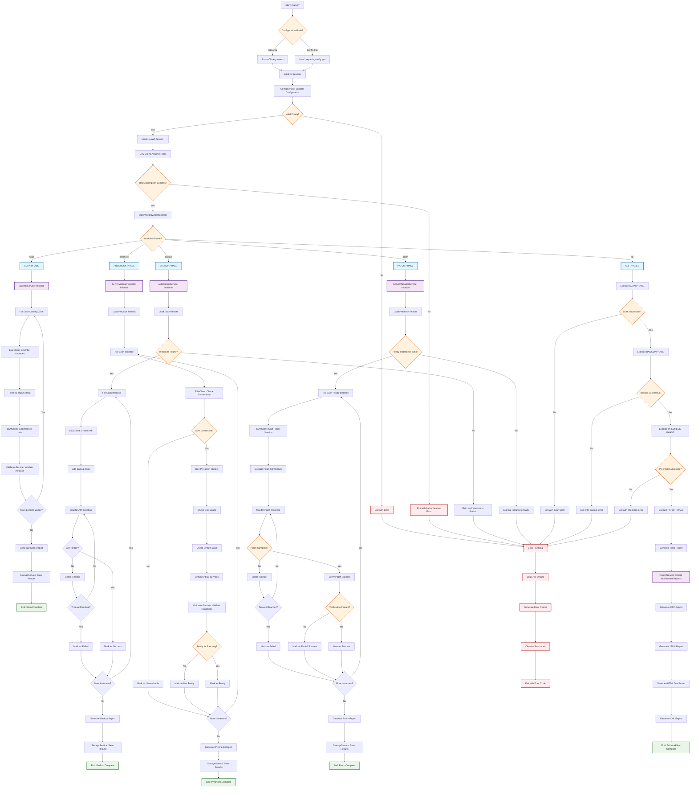

# Full Patching Workflow Diagram

## Overview

This document provides a comprehensive flow diagram of the complete patching workflow, from initial configuration to final reporting.

## Full Patching Flow



## Phase Details

### 1. Initialization Phase

- **Configuration Loading**: Parse CLI arguments or load YAML configuration
- **Service Initialization**: Initialize all core services and AWS clients
- **Authentication**: Assume AWS roles for each landing zone
- **Validation**: Validate configuration and connectivity

### 2. Scan Phase

- **Instance Discovery**: Query EC2 instances across all landing zones
- **Filtering**: Apply tag-based and criteria-based filtering
- **Information Gathering**: Collect instance metadata via SSM
- **Validation**: Validate instance eligibility for patching
- **Reporting**: Generate scan results in multiple formats

### 3. Backup Phase

- **AMI Creation**: Create AMI backups for all eligible instances
- **Tagging**: Apply consistent tagging for backup tracking
- **Monitoring**: Monitor AMI creation progress with timeout handling
- **Verification**: Verify AMI creation success
- **Reporting**: Generate backup status reports

### 4. Precheck Phase

- **Connectivity Testing**: Verify SSM connectivity to instances
- **System Checks**: Validate disk space, system load, and critical services
- **Readiness Assessment**: Determine patch readiness for each instance
- **Risk Assessment**: Identify potential patching risks
- **Reporting**: Generate precheck results and recommendations

### 5. Patch Phase

- **Patch Execution**: Execute patching commands via SSM
- **Progress Monitoring**: Monitor patch progress with timeout handling
- **Verification**: Verify patch installation success
- **Status Tracking**: Track success, failure, and partial success states
- **Reporting**: Generate comprehensive patch results

### 6. Reporting Phase

- **Multi-format Output**: Generate CSV, JSON, HTML, and XML reports
- **Dashboard Creation**: Create interactive HTML dashboard
- **Data Aggregation**: Aggregate results across all phases
- **Compliance Reporting**: Generate compliance and audit reports

## Error Handling

### Error Categories

1. **Configuration Errors**: Invalid YAML, missing parameters
2. **Authentication Errors**: AWS role assumption failures
3. **Connectivity Errors**: Network or SSM connectivity issues
4. **Resource Errors**: Insufficient permissions or quotas
5. **Timeout Errors**: Operations exceeding configured timeouts
6. **Validation Errors**: Instance or system validation failures

### Error Response

- **Logging**: Comprehensive error logging with context
- **Reporting**: Error details included in reports
- **Cleanup**: Automatic resource cleanup on failures
- **Exit Codes**: Specific exit codes for different error types

## Configuration Options

### Workflow Control

```yaml
workflow:
  phases:
    scan: true
    backup: true
    precheck: true
    patch: false # Can be controlled separately

  timeouts:
    ami_creation: 1800 # 30 minutes
    patch_execution: 3600 # 60 minutes
    ssm_connection: 300 # 5 minutes
```

### Landing Zone Configuration

```yaml
landing_zones:
  - name: "prod-us-east-1"
    account_id: "123456789012"
    region: "us-east-1"
    role_arn: "arn:aws:iam::123456789012:role/PatchingRole"
    filters:
      tags:
        Environment: "production"
        PatchGroup: "group-1"
```

## Usage Examples

### Full Workflow

```bash
python main.py --landing-zones inventory/prod_landing_zones.yml --workflow full
```

### Individual Phases

```bash
# Scan only
python main.py --landing-zones inventory/prod_landing_zones.yml --workflow scan

# Backup only (requires previous scan)
python main.py --landing-zones inventory/prod_landing_zones.yml --workflow backup

# Precheck only (requires previous scan)
python main.py --landing-zones inventory/prod_landing_zones.yml --workflow precheck

# Patch only (requires previous precheck)
python main.py --landing-zones inventory/prod_landing_zones.yml --workflow patch
```

### Configuration-Driven Workflow

```bash
python main.py --config config/prepatch_config.yml
```

This flow diagram provides a complete overview of the patching workflow, showing all decision points, error handling, and the interaction between different services and phases.
